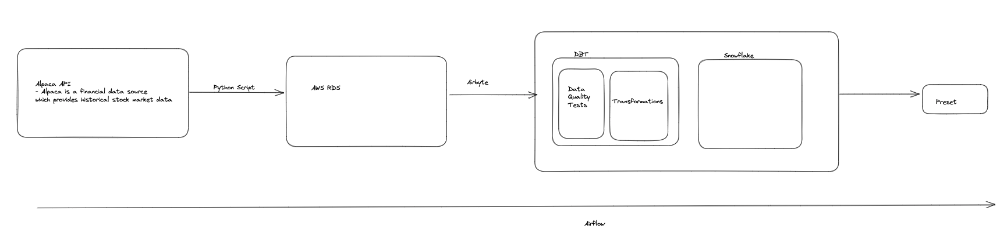
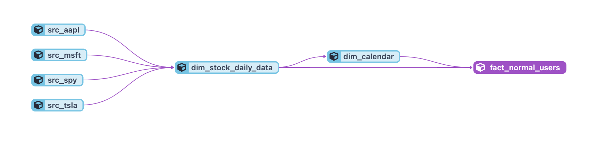
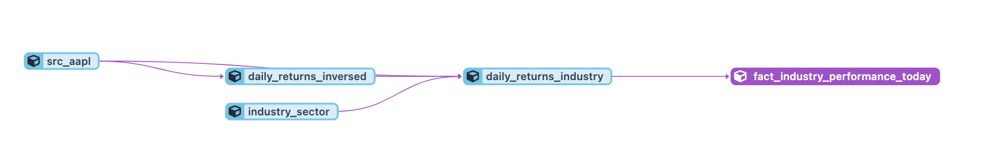
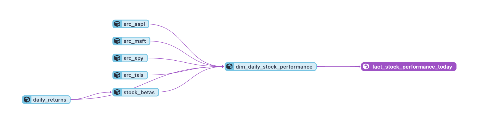
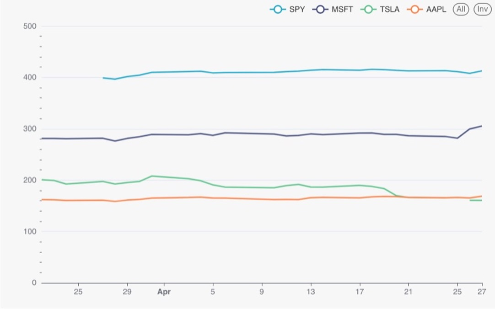

# Capstone Project

## Context

Problem Statement:
Normal users and Quantitative analysts have different use for the same financial data, as such, a data pipeline is designed to cater to both these groups of users.

## Who are the data pipeline for?

1. Normal Users

- Only concerned with the daily movement of stock prices

2. Quants

- Basically traders from financial institutions who make use of Algo to trade the markets
- use it for data science and finance related applications

## Data source:

Alpaca API

- Finance API which gives historical data of stocks
- Live Dataset which refreshes every second
- Downside: unpaid users cannot access the latest 15 minutes of stock data

## ETL Process

- Orchestration is done using Airflow or Alternatives

1. Custom ETL python code to draw from alpaca API

- Live dataset
- Full extract of 30 days worth of data (supposed to be 1 year) on the first extraction
- Incremental extract of 1 day worth of data each time subsequently
- Numerous transformations done to cater to both groups of users
- Data stored in AWS RDS

2. Airbyte to transfer data from AWS RDS to Snowflake

- Use Airbyte to do Deduped and load data to Snowflake
- The data quality will first be tested using DBT test and then it will be transformed using DBT before reaching snowflake (data warehouse)

3. Preset

- Preset is then used for data visualisation

## Tech Stack

- AWS RDS (postgres SQL)
- Airbyte Cloud
- DBT Cloud
- Snowflake (data warehouse)
- Preset (Visualisation tool)

## Data Architecture

## Dimensional models

## Data Quality and Validation

Data quality testing is performed using dbt test, which helps maintain the integrity of the data throughout the pipeline.

## Final dashboard

